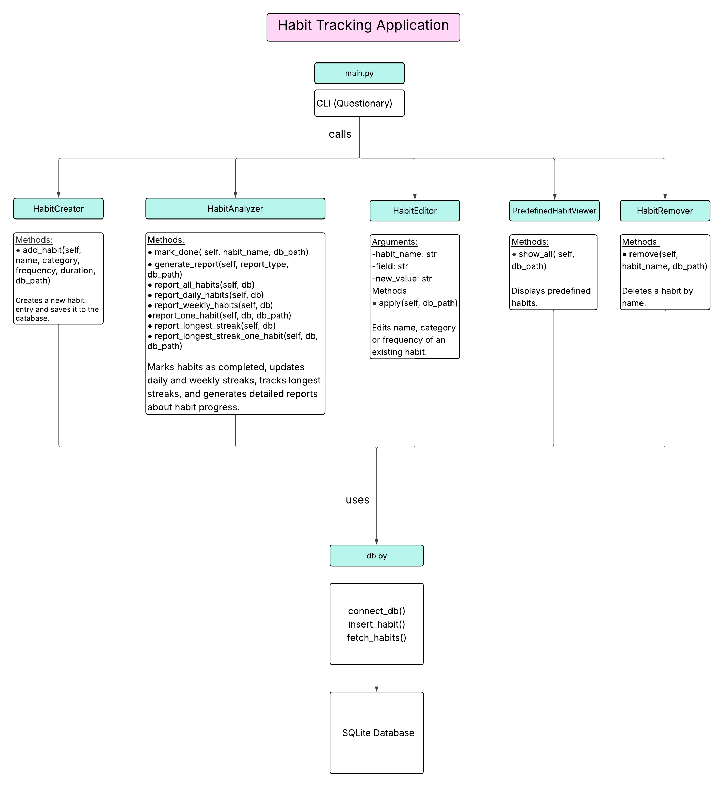

# Habit Tracker Application
This is a Python backend for a habit tracking application built using object-oriented and functional programming.

## Overview
This application allows users to create, manage, edit, and delete daily and weekly habits. Users can mark habits as completed, view predefined habits, and track their progress through reports and streak analytics.

## Project Structure
```shell

oofpp_habits_project/
│
├── files/
   ├── data.db
   └── predefined-habits.db
├── Screenshots/
   ├── Diagram.png
   ├── Screenshot 2025-09-14 213031.png
   ├── Screenshot 2025-09-14 213855.png
   ├── Screenshot 2025-09-14 224054.png
   ├── Screenshot 2025-09-14 224252.png
   ├── Screenshot 2025-09-14 224437.png
   ├── Screenshot 2025-09-14 224642.png
   ├── Screenshot 2025-09-15 151325.png
   └── Screenshot 2026-07-12 155756.png  
├── .gitignore  
├── db.py           
├── habit_tracker.py        
├── main.py       
├── README.md       
├── requirements.txt            
└──  test.py   
```

## UML Class Diagram


## Screenshots
### Menu

### Create a habit

### Modify a habit

### View Reports

### Check-off

### Remove a habit

### View predefined habits

### Running the tests


## Installation
1. Clone the Repository
```shell
git clone https://github.com/hanashammah/habit_tracking_app.git
```
2. Navigate to the Project Folder
```shell
cd habit_tracking_app
```
3. Install Dependencies
```shell
pip install -r requirements.txt
```

## Running the Application

Run the application with:

```shell
python main.py
```
Follow the instructions shown on the screen.

## Tests
Run the unit tests with:
```shell
pytest .
```